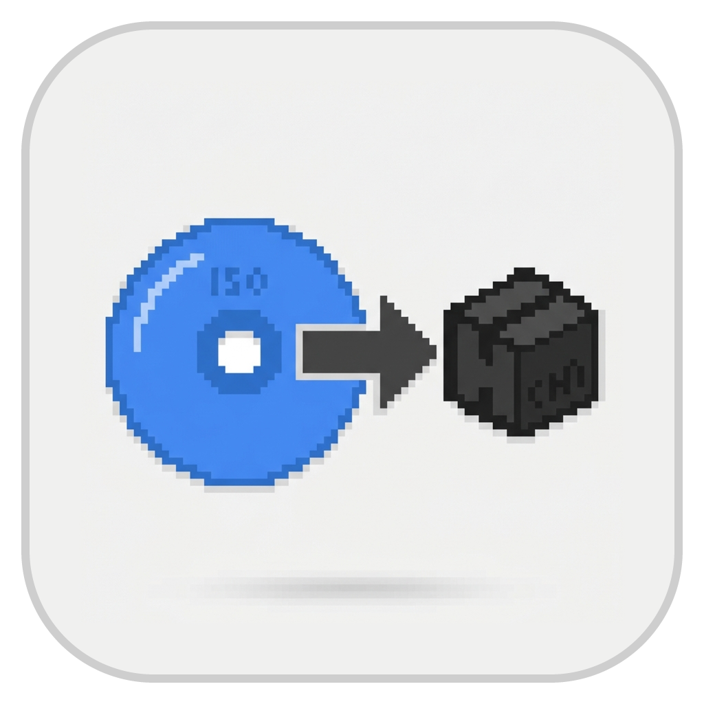
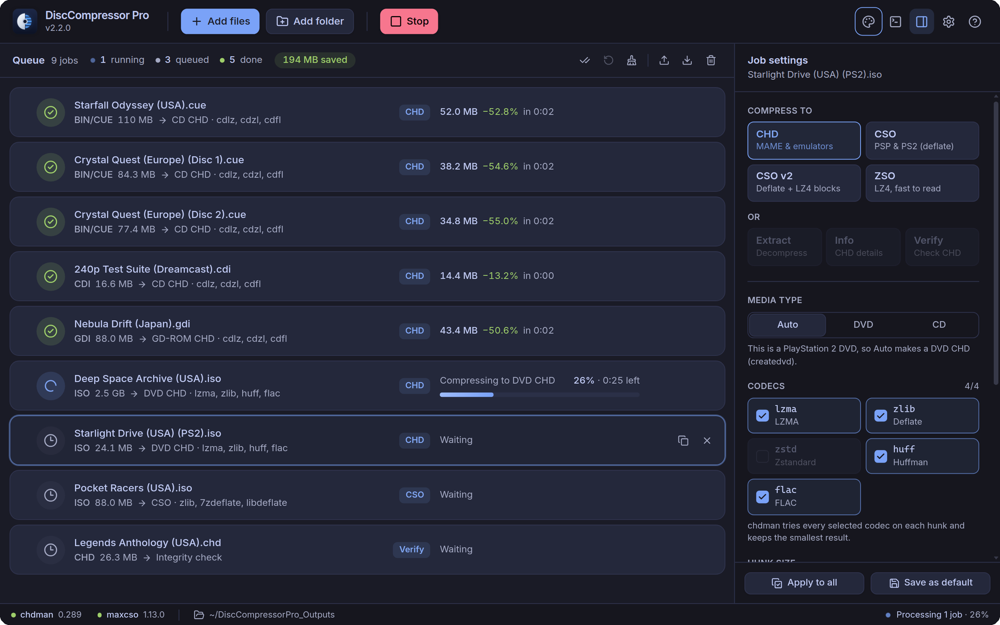

# DiscCompressor Pro

A fast, good-looking desktop app for converting disc images. It queues up BIN/CUE, GDI, CDI, ISO, CHD, CSO, ZSO and DAX files and converts them
with [chdman](https://docs.mamedev.org/tools/chdman.html) (from MAME) and [maxcso](https://github.com/unknownbrackets/maxcso), showing real
progress for every job.



See the [2.1.2 release notes](docs/releases/2.1.2.md) for what changed since 1.3.1, with more screenshots.

## Download

Releases include chdman 0.289 and maxcso 1.13.0, so nothing else needs to be installed.

| System            | File                                           | Notes                                                             |
| ----------------- | ---------------------------------------------- | ----------------------------------------------------------------- |
| Windows 10/11 x64 | `DiscCompressorPro-<version>-Setup-x64.exe`    | Installs for the current user; the install folder can be changed. |
| Windows 10/11 x64 | `DiscCompressorPro-<version>-Portable-x64.exe` | Runs without installing.                                          |
| Linux x86-64      | `DiscCompressorPro-<version>-x86_64.AppImage`  | `chmod +x` the file and run it. No libfuse2 needed.               |

The Windows files are not code-signed, so SmartScreen may warn the first time; choose **More info → Run anyway**. If an AppImage cannot be
mounted (no FUSE at all, e.g. in some containers), start it with `--appimage-extract-and-run`. On distributions that restrict
unprivileged user namespaces, such as Ubuntu 24.04, the AppImage starts with Chromium's sandbox turned off. Desktop notifications on Linux
use the system's libnotify.

Each release lists SHA-256 checksums in `SHA256SUMS.txt` and includes `DiscCompressorPro-<version>-sources.tar` with the source code of the
(L)GPL components of the bundled tools, the AppImage runtime, the installer and Electron's FFmpeg (see [Licences](#licences)).

## What it does

| From              | To                                                                       |
| ----------------- | ------------------------------------------------------------------------ |
| BIN/CUE           | CHD; CSO / CSO v2 / ZSO for single-data-track discs                      |
| GDI               | CHD (GD-ROM)                                                             |
| CDI (DiscJuggler) | CHD, BIN/CUE (extract)                                                   |
| ISO               | CHD (as CD or DVD), CSO, CSO v2, ZSO                                     |
| CHD               | BIN/CUE, GDI, ISO or CDI (extract), recompressed CHD, CSO / CSO v2 / ZSO |
| CSO / ZSO / DAX   | ISO (extract), CHD, or another CSO format                                |
| CHD               | Info and Verify                                                          |

- **A queue you can drive with a mouse or the keyboard.** Drop files or whole folders (images inside are found automatically and track files
  referenced by cue/GDI sheets are not added twice), reorder by dragging, select with Shift/Ctrl or by dragging a rectangle, and edit the
  settings of many jobs at once.
- **Every tool option, validated.** CHD codecs (up to four), hunk sizes that chdman accepts, CD or DVD media for ISOs, maxcso block sizes
  and compression methods, extraction formats and thread counts. Impossible choices are disabled with the reason shown, e.g. why a disc with
  audio tracks cannot become an ISO.
- **Real progress.** chdman's own progress is parsed; maxcso prints none when run by another program, so its progress is measured from the
  bytes it has read. The taskbar shows overall progress and the computer is kept awake while jobs run.
- **DiscJuggler images, which chdman cannot read.** CDI files (versions 2.0 to 3.5) are read by the app itself and become a CHD or BIN/CUE
  with every track in place. A Dreamcast CD-R keeps its data track in a second session, which CHD files cannot record: the CHD puts it where
  Flycast looks for it, the cue sheet marks the sessions, and extracting such a CHD to BIN/CUE or CDI gives the disc its second session back.
- **Safe by design.** Jobs work in a hidden temporary folder inside the output folder and finished files are moved into place only on
  success, so cancelled or failed jobs leave nothing half-written behind (and anything left by a crash is removed at the next start). An
  input file is never overwritten, jobs never overwrite each other's results, and "delete originals" moves files to the trash — never after
  Info or Verify. Verify only passes when chdman confirms every checksum.
- **Extras:** `.m3u` playlists for multi-disc games, a skip/keep-both/replace choice for outputs that already exist (skip by default;
  running a job again writes a numbered copy), output next to the source files or in one folder, queue import/export (including v1 queue
  files), a searchable console, 13 themes plus "match system", and minimize-to-tray.

## Tools

DiscCompressor Pro looks for chdman and maxcso in this order:

1. a file chosen in **Settings → Tools**;
2. the copies bundled with the app (`resources/bin` in a release; `resources/bin/<os>-<arch>`, e.g. `linux-x64` or `win-x64`, when running
   from source after `npm run tools:win` or `npm run tools:linux`);
3. the system `PATH` (for example `mame-tools` on Debian/Ubuntu).

The status bar shows which versions were found; click it to open the tool settings.

## Development

Requires Node.js 22.12 or newer.

```sh
npm install
npm run dev          # start the app with hot reload
npm run check        # type-check, lint and unit tests
npm run test:integration   # end-to-end tests against real chdman and maxcso (PATH, or DCP_CHDMAN / DCP_MAXCSO)
npm run build        # production bundles in out/
```

### Building releases

Both commands put their output in `release/`:

- `npm run dist:win` builds the Windows installer and portable EXE. It downloads chdman.exe from the official MAME 0.289 release and
  maxcso.exe from the official maxcso 1.13.0 release, checks them against pinned SHA-256 checksums and unpacks them with a WebAssembly
  build of 7-Zip (`scripts/fetch-windows-tools.mjs`). It runs on Windows, or on Linux with Wine installed (including 32-bit support,
  e.g. `wine64` and `wine32:i386` on Ubuntu), which NSIS needs to create the uninstaller.
- `npm run dist:linux` builds the AppImage on x86-64 Debian or Ubuntu. `scripts/build-linux-tools.sh` compiles static chdman and maxcso
  from the official source releases first, which takes a while the first time; it needs the packages `build-essential python3 curl file
  pkg-config libsdl2-dev libuv1-dev liblz4-dev zlib1g-dev`, and records the compiler and binutils it used and the Debian packages linked
  into the tools. The AppImage is packed without the extra libraries electron-builder normally adds, which Electron 44 does not use
  (`scripts/appimage-tools.mjs`).
- `npm run sources`, after `dist:linux`, writes `release/DiscCompressorPro-<version>-sources.tar` (`scripts/collect-sources.mjs`); it
  needs git and GNU tar.

GitHub Actions checks every pull request on Windows and Linux (`.github/workflows/ci.yml`) and builds all four files, including the
end-to-end tests with the bundled tools (`.github/workflows/build.yml`). For a `v*` tag matching the version in `package.json` it
creates a draft release with the files and their checksums. Once that version's notes are on `main` in `docs/releases/<version>.md`,
`.github/workflows/publish-release.yml` publishes the draft with them and deletes drafts of older versions.

### Licences

The licence texts of the bundled tools, of the AppImage runtime and installer plug-ins, and of every npm package in the app are in
`resources/licenses`, which ships with the app. `THIRD_PARTY_NOTICES.txt` there explains which is which; it is generated by
`npm run notices` from the packages the build puts into the app (CI fails if it is out of date). The sources archive of each release
holds the source of the components under the GNU (L)GPL that the release adds to Electron — the C library in the Linux tools, 7-Zip
code in maxcso and in the installer, and libfuse in the AppImage runtime — plus the MAME and maxcso sources, so the tools can be rebuilt
and relinked. It also holds Chromium's FFmpeg, which Electron ships as a separate LGPL library; the complete sources of Electron and
Chromium, which contain further LGPL code such as parts of Blink, are published by those projects (the notices name the exact versions).

The code is organised as follows and built with [electron-vite](https://electron-vite.org/):

- `src/main` — the Electron main process: settings, tool discovery, image scanning (CUE/GDI/CDI/CHD/CSO parsers), the job planner that turns
  a job into chdman/maxcso commands and the app's own steps (ISO and CDI conversion), and the runner that executes them.
- `src/preload` — the small, typed bridge the page is allowed to use (context isolation is on, and so is Chromium's sandbox wherever
  the system allows it).
- `src/renderer` — the React interface, with state in [zustand](https://github.com/pmndrs/zustand) stores and styles in Tailwind CSS.
- `src/shared` — types and format rules used by both sides.

`scripts/generate-icons.py` rebuilds every icon from `assets/icon-source.png`.
